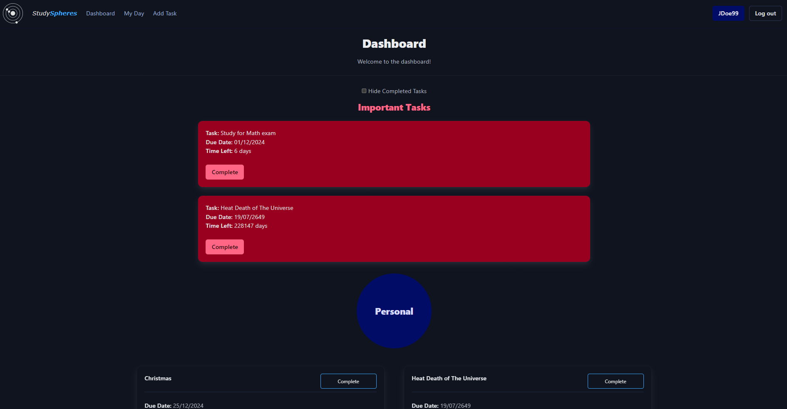

# StudySpheres
### Your Ultimate Study Companion
Welcome to StudySpheres! <br>
StudySpheres is a simple, effective way of managing your tasks. <br>
Our platform helps you stay organized and on top of your studies. Whether you're managing assignments, tracking deadlines, or planning your study schedule, StudySpheres has got you covered. <br>
Join us and take control of your academic journey with ease and efficiency.


### Features
- Create, edit, and delete tasks with ease
- Mark tasks as complete
- Track due dates for your tasks
- Organise tasks into custom groups



### Installation
1. Ensure you have Python version 3.12.1 or later (Python can be downloaded from <a href="https://www.python.org/downloads/">here</a>.)
2. Clone the repository
3. Open the folder in your terminal and type ```pip install requirements.txt``` to install the requirements.
4. Run app.py
5. Open the server address provided in the terminal in your preferred web browser.
